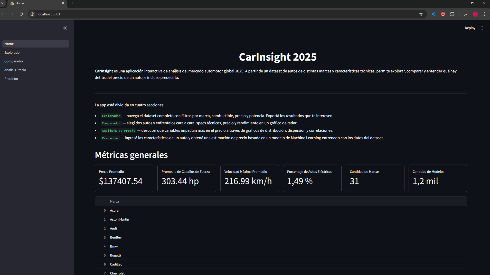

# 🚗 CarInsight 2025

Aplicación interactiva de análisis del mercado automotor global 2025. Permite explorar, comparar y entender qué hay detrás del precio de un auto, e incluso predecirlo mediante modelos de Machine Learning.

---

## 📸 Demo


---

## 📁 Estructura del proyecto

```
car-analytics-dashboard/
│
├── Home.py                         # Página principal con métricas generales
├── utils.py                        # Funciones compartidas (carga de datos, filtro de outliers)
├── requirements.txt
│
├── pages/
│   ├── 1_Explorador.py             # Explorador interactivo con filtros y descarga
│   ├── 2_Comparador.py             # Comparador de 2 autos con gráfico de radar
│   ├── 3_Analisis_Precio.py        # Análisis de precios por marca, combustible y correlaciones
│   └── 4_Predictor.py              # Predictor de precio con múltiples modelos de ML
│
├── src/
│   └── data_preprocessing.py       # Script de limpieza del dataset crudo
│
└── data/
    ├── raw/
    │   └── Cars-Datasets-2025.csv  # Dataset original de Kaggle
    └── processed/
        └── cars_cleaned.csv        # Dataset limpio (generado por data_preprocessing.py)
```

---

## 🚀 Cómo correr el proyecto

**1. Clonar el repositorio**
```bash
git clone https://github.com/GRB55/car-analytics-dashboard.git
cd car-analytics-dashboard
```

**2. Crear un entorno virtual e instalar dependencias**
```bash
conda create -n carinsight python=3.10
conda activate carinsight
pip install -r requirements.txt
```

**3. Preprocesar los datos**
```bash
python src/data_preprocessing.py
```

**4. Correr la app**
```bash
streamlit run Home.py
```

---

## 📊 Páginas

| Página | Descripción |
|---|---|
| 🏠 Home | Métricas generales del dataset: precio promedio, HP, velocidad, marcas |
| 🔍 Explorador | Filtrá el dataset por marca, combustible, precio y HP. Exportá a CSV |
| ⚔️ Comparador | Elegí 2 autos y comparalos con métricas y gráfico de radar |
| 📊 Análisis de Precio | Visualizaciones por marca, combustible y matriz de correlación |
| 🤖 Predictor | Ingresá specs de un auto y predecí su precio con 6 modelos de ML |

---

## 🛠️ Stack tecnológico

- **Python 3.10**
- **Streamlit** — interfaz web interactiva
- **Pandas** — manipulación de datos
- **Plotly** — visualizaciones interactivas
- **Scikit-learn** — modelos de Machine Learning y preprocesamiento
- **XGBoost** — modelo de gradient boosting

---

## 📂 Dataset

Fuente: [Cars Dataset 2025 — Kaggle](https://www.kaggle.com/datasets/abdulmalik1518/cars-datasets-2025)

Columnas originales: `Company`, `Car Name`, `Engine`, `CC/Battery`, `HP`, `Speed`, `0-100 km/h`, `Price`, `Fuel`, `Seats`

---

## 👤 Autor

**Gonzalo Rios Barcelo** — [@GRB55](https://github.com/GRB55)
